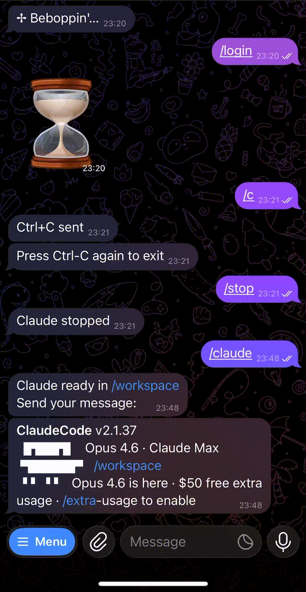

<table border="0">
  <tr>
    <td><h2>Telegram as a terminal for coding agents — every thread is a tab</h2>

TelegramCode turns Telegram into a terminal for running agentic CLIs. A forum
supergroup is the terminal window; each topic (thread) is a tab of that
terminal — bound to a subfolder under `WORK_ROOT` and running its own fully
isolated **Claude Code** or **OpenCode** session. Open as many tabs as you
need (even two on the same project for parallel work) and drive the agents
from your phone or tablet, voice messages included.

Think **OpenClaw for vibe coding**, driven entirely from Telegram: no complex
setup, no extra dashboards — direct access to your own **OpenCode** /
**Claude Code** running on your machine or server.

### Features

- **Multi-thread routing** — one topic per task, isolated tmux + opencode sessions; two topics can share one folder for parallel work
- **Two chat surfaces** — forum-group topics and/or the owner's bot DM (`CHAT_MODE`), tabs on both
- **Agent backends** — Claude Code (tmux-scrape or stream-json backend, `/claude_mode`) and first-class OpenCode (native server API over HTTP+SSE: sessions, models, reasoning effort, interactive questions), picked per-thread
- **Smart question alerts** — when the agent asks something, the bot pins the question message: a pin pierces muted topics, so you get exactly one notification per question (unpinned once answered)
- **Restart-surviving sessions** — agents run in external processes; a bot restart re-adopts them, and the json-stream backend even replays the output produced while the bot was down
- **Scheduled prompts** — `/schedule` cron / one-shot / N-times per topic; the agent schedules itself via injected MCP tools
- **File intake** — photos / documents / video / audio sent to a topic are saved and announced to the agent; albums arrive as one prompt
- **Raw terminal** — `/terminal` binds a topic to a real `$SHELL` in the project folder
- **Voice input** — Whisper transcription via Groq (preferred) or OpenAI
- **Display verbosity** — `/verbosity` (plus `/thinking`, `/tool_results`, `/subagent`) per topic: `minimal|short|full`
- **MCP hierarchy** — user / group / project / thread, with `${VAR}` env expansion, plus bot-injected scheduling/file tools
- **Observability** — always-on output trace (`/trace`), console log buckets, `/timestamps`
- **Two-instance ready** — pet vs work, isolated DATA_DIR, group, port
    </td>
<td width="280"></td>
  </tr>
</table>

> **Breaking 2.0** — the old "one bot = one private chat = one folder" mode
> is gone. The bot now requires a Telegram forum supergroup for the group
> surface (`CHAT_MODE=dm` works without one); start
> `telegramcode` from the parent folder containing your projects and that `$PWD`
> becomes the work root. See [Migration from 1.x](#migration-from-1x).

## Two surfaces: group topics, bot DM, or both

The bot serves two Telegram surfaces, selected by `CHAT_MODE`
(`group` | `dm` | `both`, default `both`):

- **Forum supergroup** — every topic is a tab. The most familiar UX: a visible
  topic list, per-topic names and icons, quick switching between agents. The
  trade-off is Telegram's group throughput cap (about 20 messages/min per
  group), so the bot paces and coalesces heavy output streams.
- **The bot's own DM** (owner only, gated by `OWNER_USER_ID`) — the private
  chat runs in topic mode too, so you get the same thread-per-agent tabs
  there, and live output streams through Telegram's native draft "cursor":
  the reply grows in place in one message instead of arriving as a flood of
  separate messages.

With `both` (the default) one instance serves the group and the owner DM at
once; if `OWNER_USER_ID` is not set, the DM surface stays inert and the
instance is effectively group-only.

## Where to run the bot server

The bot runs anywhere the agent CLIs run:

- **Your own working machine** — the simplest start: launch `telegramcode`
  from your projects parent folder and your laptop/desktop becomes the
  backend. The catch: agents are only reachable while the machine is on and
  awake.
- **A remote server (cloud VPS/VDS or bare metal)** — the more convenient
  setup: organize your working environment there once (git + your repos,
  Claude Code / OpenCode, `telegramcode`) and you get an always-on dev box you
  drive from any device through Telegram — phone, tablet, voice. When picking
  one, a bare-metal server without virtualization beats a virtualized VPS/VDS:
  its NVMe drives are usually much faster, which matters once you also build
  and run a dev server there, not just the agents. Classic terminal access to
  the very same Claude sessions stays available over SSH — run plain `claude`
  in the project folder: it reads the same `~/.claude/projects/<cwd-slug>/`
  session store the bot uses, so a session started in a Telegram thread can
  be picked up in the terminal and vice versa.

## Quick Start

### 1. Create the bot

1. Message [@BotFather](https://t.me/BotFather), send `/newbot`, follow prompts.
2. Save the token (`123456789:ABCdef...`).
3. **Disable privacy mode** — same chat: `/setprivacy` → pick this bot →
   `Disable`. Without this the bot only sees `/commands`, not free-form text.

### 2. Create the forum supergroup

1. In Telegram client: `New Group` → name it → add the bot.
2. Open group settings → enable **Topics** (Forum mode).
3. Promote the bot to admin with these rights:
   - `Manage Topics` (required — bind/create threads)
   - `Delete Messages` (for `/clear_messages`)
   - `Pin Messages` (per-thread status banner — `/doctor` warns if missing
     but the bot still operates without it)
4. **Remove the bot from the group and add it again.** Telegram caches the
   privacy-mode flag on join; without re-adding the bot keeps the old
   private-mode and ignores free-form messages. See
   [Troubleshooting → Bot doesn't see text](#bot-doesnt-see-text).

### 3. Find your user id (group id is automatic)

- Your user id: send `/start` to [@userinfobot](https://t.me/userinfobot).
- Group id: **you don't need to find it.** Leave `ALLOWED_GROUP_ID`
  empty. The bot auto-pairs with the first forum supergroup an allowed
  user contacts it from — it captures the `-100…` id, saves it to
  `state.json`, and replies a confirmation. Re-point later with `/pair`
  inside another group.
  - To pin a specific id by hand instead, set `ALLOWED_GROUP_ID` to the
    numeric value (a group **name** is not accepted — Telegram addresses
    chats only by numeric id). A numeric env value disables auto-pairing.

### 4. Run with Docker

```bash
git clone https://github.com/olosegres/telegramcode
cd telegramcode/examples
cp .env.example .env       # edit values
docker compose up -d
```

The compose file ships **two services** — `telegramcode-pet` and
`telegramcode-work`. If you only need one, comment out the other or copy
just the block you want. The pair is set up so they cannot collide
(separate tokens, groups, data volumes, opencode ports — see
[Two instances on one host](#two-instances-on-one-host)).

### 4b. Or run as a global CLI (`telegramcode`)

Skip Docker entirely and install the bot as a Node binary on the host:

```bash
git clone https://github.com/olosegres/telegramcode && cd telegramcode
yarn install && yarn build
npm install -g .            # registers the `telegramcode` command
                            # (the legacy `telegramCode` spelling still works as an alias)

mkdir -p ~/.config/telegramcode
cp .env.example ~/.config/telegramcode/.env
$EDITOR ~/.config/telegramcode/.env    # fill TELEGRAM_BOT_TOKEN (group auto-pairs; access = its admins)

cd ~/projects && telegramcode          # WORK_ROOT defaults to $PWD = ~/projects
```

Shortcut: `yarn install-link` runs `yarn install && yarn build && npm link`
in one shot — `npm link` symlinks the global `telegramcode` to this folder, so
later rebuilds (`yarn build`) are picked up without re-installing.

The wrapper looks for env in two places (in order):

1. `~/.config/telegramcode/.env` — base, set once, used everywhere
   (the legacy `~/.config/telegram-code/.env` is still read as a fallback
   when the new path does not exist)
2. `$PWD/.env` — per-project override

`telegramcode` should normally be launched from your projects parent; that
directory becomes the work root. A single-instance lockfile
(`$DATA_DIR/instance.lock`) prevents a second bot starting under the same
user; cross-user instances are naturally isolated by `HOME`-derived
`DATA_DIR`. Stale locks (after `kill -9`) are reclaimed automatically.

To continue the same sessions from a terminal, no wrapper is needed: run
`claude --dangerously-skip-permissions` in the project folder. It is the
same binary and the same `~/.claude/projects/<cwd-slug>/` session store
the bot uses, so a session started in a Telegram thread can be picked up
in the terminal (`claude --resume`) and vice versa.

### 5. Use it

1. Open the group in Telegram.
2. In the General topic, send `/ls` — bot lists subfolders under `WORK_ROOT`.
3. Create a topic (`+` button).
4. In the new topic: `/bind <subdir>` (auto-bound if the topic name
   matches a subdir).
5. `/claude` or `/opencode` → talk to the agent.
6. `/quit` to end the session; bare `/bind` to inspect the binding;
   `/clear_messages` to delete the topic's bot messages.

## Architecture

```
$PWD=/home/user/src                     ← launch `telegramcode` here
├── projectAlpha/     ← Topic "projectAlpha"    (claude)
├── projectB/         ← Topic "projB-frontend"  (claude)
│                     ← Topic "projB-backend"   (opencode)   ← one folder, two topics
│                     ← Topic "projB-refactor"  (claude)
└── telegramcode/     ← Topic "telegramcode"    (claude)

Telegram forum supergroup
├── Bot is admin with can_manage_topics + can_delete_messages + can_pin_messages
└── Routes by ThreadKey = (chatId, threadId)  →  src/state.ts persists bindings
```

Routing key is `(chatId, threadId)` everywhere. Per-thread state lives in
`${DATA_DIR}/state.json` (atomic writes with `fsync`, archived on
corruption). Bot-owned tmux sessions are named per backend —
`claude-<chatId>-<threadId>` (Claude tmux-scrape), `cjson-…` (the Claude
json-stream host process), `term-…` (terminal) — see
`src/utils/tmuxSessionName.ts`; opencode sessions are keyed by the same
`<chatId>:<threadId>` string. Two topics on the same folder stay independent.

### Adapter pattern

```
Telegram <-> bot.ts <-> AgentAdapter <-> { Claude CLI (tmux scrape) | Claude CLI (stream-json) |
                 │           │             OpenCode (HTTP+SSE)      | Terminal ($SHELL in tmux) }
                 │           └── state.ts  (bindings, claudeSessionId, opencodeSessionId,
                 │                          messages, MCP per-thread overrides)
                 └── OutputTransport (src/output/) — how output reaches each surface,
                     picked once at boot by CHAT_MODE: group edit-in-place stream
                     vs the owner-DM native draft "cursor"
```

Each adapter implements `AgentAdapter` from `src/types.ts`:
- `startSession(key, workDir, args?, sessionId?)` / `stopSession(key)` / `resumeSession(key, workDir, sessionId, options?)`
- `sendInput(key, text)` / `sendSignal(key, signal)`
- events: `output`, `status`, `question`, `questionGone`, `thinking`,
  `toolResult`, `subagentStatus`, `apiError`, `started`, `stopped`, `closed`,
  `error` (all emit `ThreadKey` first)

## Commands

### In any topic

Most commands work in any topic; a binding (`/bind`) is required only to
actually start an agent or terminal in the folder.

| Command | Description |
|---|---|
| `/claude`, `/opencode`, `/oc` | Start agent in this topic's bound folder |
| `/terminal` | Open a raw `$SHELL` in the bound folder — see [Raw terminal](#raw-terminal-terminal) |
| `/claude_mode` | Switch this topic's Claude backend (tmux-scrape ⇄ json-stream); bare shows a picker — see [Claude Code backends](#claude-code-backends-claude_mode) |
| `/model` | Switch model |
| `/connect` | Connect an OpenCode provider API key (bare `/connect` arms a paste mode; the message carrying the key is deleted) |
| `/effort` | Set reasoning effort (per-thread) via inline buttons. Claude: native `/effort` levels (`low…ultracode`). OpenCode: the current model's variants, applied per-prompt. No env configuration |
| `/verbosity` | Output-verbosity macro (`minimal\|short\|full`): sets the thinking, tool-results and sub-agent display prefs at once; `/thinking`, `/tool_results`, `/subagent` point-override afterwards. Mixed prefs show as "custom" in the picker |
| `/thinking` | Chain-of-thought display: `full` keeps the reasoning, `short` collapses to "💭 thought for Ns", `minimal` keeps only the live working cue |
| `/tool_results` | Completed tool-call output: `full` whole body, `short` capped (15 lines / 1200 chars), `minimal` transient 🔧 status only |
| `/subagent` | Sub-agent transcript: status-only with a ticking elapsed counter (`minimal`/`short`), or streamed "🤖 ⤷" chunks (`full`) |
| `/sessions` | List & resume previous sessions in this folder |
| `/rename_session` | Rename the current live session (OpenCode; Claude transcripts have no title) |
| `/quit`, `/q` | End the session — Claude: graceful double Ctrl+C; OpenCode/terminal: `stopSession`. Releases the persisted session id, so a bot restart won't auto-reattach it (resume later via `/sessions`) |
| `/new`, `/clear_session` | End the current session and start a fresh one (same adapter) |
| `/status` | This thread's status |
| `/output` | Last 500 lines of agent output (sent as at most 5 chunks; the overflow is reported as omitted) |
| `/c`, `/y`, `/n` | Ctrl+C / "y" / "n" |
| `/enter`, `/up`, `/down`, `/tab` | tmux key passthrough |
| `/esc`, `/escape` | Send a raw Escape — interrupt the current turn / dismiss a selector |
| `/schedule` | Schedule a prompt in free text — the agent parses the time and owns the job; see [Scheduler](#scheduler-schedule) |
| `/clear_messages` | Delete bot messages in this topic (up to 48h, Telegram limit) |
| `/clear` | Forwarded to the agent (Claude wipes context; OpenCode plain text) — not a bot command anymore. Also purges the topic's file-intake dir |
| `/compact` | Forwarded verbatim to the agent (Claude compacts its context) — not bot-owned |
| `/bind` | Bare: current binding + folder picker, with «leave current dir» (the old `/unbind`) and «create new folder» buttons |
| `/mcp` | List MCP servers active for this thread |

### Info / ops (work anywhere)

| Command | Description |
|---|---|
| `/start` | Intro: work root + available agents |
| `/help` | Context-aware help |
| `/ls` | List subdirs under `WORK_ROOT` |
| `/list` | List existing topics and their bindings |
| `/status` | This thread's status; in General — a global view of all topics + active agents |
| `/doctor` | Self-diagnose: admin rights, privacy mode, paths, CLIs |
| `/version` | Versions: bot, claude, opencode, node, tmux |
| `/whoami` | Show userId, chatId, threadId, isAllowed, binding |
| `/trace` | Output-trace recorder (`on`/`off`, `on all`/`off all`; bare = status) — see [Observability](#observability) |
| `/timestamps` | Prepend the send time to prompts forwarded to the agent (`on`/`off`; bare = status) |
| `/pair` | Bind this forum supergroup to the bot (re-point auto-pairing) — works from any topic of the target group; a numeric `ALLOWED_GROUP_ID` env locks pairing |

### General-only

| Command | Description |
|---|---|
| `/quit-all`, `/quitall` | End every active agent in every bound topic (also releases their session ids) |

### Natural language

In a bound topic you can also type:
- `claude fix the bug` / `opencode add tests`
- A plain message after `/claude` is already running → routed as input.

Voice messages are transcribed via Groq Whisper (free) or OpenAI Whisper
(fallback) and follow the same routing.

`/terminal` is never started from a natural-language phrase — only the
explicit command opens a shell.

## Claude Code backends (`/claude_mode`)

"Claude Code" in a topic is one user-facing choice with two interchangeable
backends:

- **tmux-scrape** (`/claude_mode tmux`) — the classic TUI driven by
  keystrokes inside tmux; output is scraped from the pane. The current
  **default**.
- **json-stream** (`/claude_mode json`) — `claude -p` in stream-json mode as
  an external tmux-hosted process emitting structured events. Cleaner
  output, and it survives bot restarts (the bot re-adopts the process and
  replays what was produced during the downtime). Limitation for now: it
  cannot host the interactive `/login` flow — switch the topic to
  tmux-scrape via `/claude_mode` to log in. That is why tmux-scrape is
  temporarily the default.

Both backends drive the same `claude` CLI against the same on-disk
transcript, so `/claude_mode` switches a live topic seamlessly — the
conversation resumes on the other backend. The pick persists per topic
(▶️ Claude and `/claude` reopen it). Billing note: the json-stream backend
strips `ANTHROPIC_API_KEY` from the agent's env, so usage bills to your
Claude subscription rather than an API key.

## Scheduler (`/schedule`)

A topic can have scheduled prompts: at fire time the bot posts the prompt
into the topic, pins the announcement (pins accumulate as run history),
waits for a busy agent to go idle (up to 10 min, rather than interrupting
live work) and delivers it — reusing the active session or starting one
with the thread's last-used backend.

- `/schedule <free text>` is a thin wrapper — the bot owns no date parsing.
  The agent interviews you (bare `/schedule`) or parses "every day at 9" /
  "tomorrow 15:00" itself, then calls the bot-injected `schedule_create` /
  `schedule_list` / `schedule_cancel` MCP tools (cron, one-shot, or
  N-times; min interval 5 min; up to 30 jobs per topic).
- Restart-safe: timers re-arm at boot; a run missed during downtime fires
  one catch-up annotated with the missed time.
- Leaving a folder pauses the topic's jobs; `/bind` resumes them (an
  expired one-shot is dropped). Run history:
  `DATA_DIR/scheduler-runs.jsonl`.

## Raw terminal (`/terminal`)

`/terminal` binds the topic to a real interactive `$SHELL` (in tmux) in the
bound folder — a third backend alongside the agents, mutually exclusive
with them. Every plain message is typed in as a command; output streams
back as one rolling message per command. Raw keys reuse the TUI commands:
`/c` (Ctrl-C), `/up` `/down` (history), `/tab` (completion), `/enter`.
Restart-safe like the agents: the shell survives a bot restart and is
re-adopted. Known v1 limitation: full-screen TUIs (vim, htop, less) render
messy; normal commands, builds, and logs stream cleanly. The shell comes
from the `SHELL` env (fallback `/bin/bash`).

## File intake

Send a file to a bound topic with an active agent and the bot hands it to
the agent:

- Six kinds: photo, document (incl. PDF), video, video note, audio,
  animation. Voice is **not** intake — it stays on the transcription path.
- The file is downloaded to `DATA_DIR/files/<chatId>_<threadId>/`
  (bot-owned, never inside your project folder) and announced to the agent
  as `[Telegram file] … saved to: <path>` plus your caption.
- A media album (several files sent as one message) is batched into ONE
  combined `[Telegram album]` prompt instead of N separate ones.
- Limits and cleanup: 20 MB per file (Telegram Bot API cap); forwarding a
  bare `/clear` purges the topic's intake dir (the agent's context is gone,
  so the files are useless); files older than 30 days are swept daily.

## Observability

- **Output trace** — ON by default for every thread: each incoming update,
  adapter emit, and outgoing Bot API call (with outcome, incl. 429 details)
  is recorded into hourly buckets `DATA_DIR/output-trace-*.jsonl` (pruned
  after 6h). `/trace off all` turns it off durably; bare `/trace` reports
  status. This is the source of truth when debugging "a message never
  reached the topic".
- **Console tee** — the bot's stdout/stderr is mirrored to
  `DATA_DIR/bot-console-*.log` (same hourly buckets, same 6h prune), so
  boot logs stay readable post-incident without the operator's terminal.
- **`/timestamps on`** — prepends each forwarded prompt's send time
  (local-offset ISO) so a days-long session knows what "yesterday" means.
  Agent-facing only, default off, persisted per topic.

## Environment Variables

### Set Before Launch

| Variable | Description |
|---|---|
| `TELEGRAM_BOT_TOKEN` | Token from @BotFather |

Start from the parent folder containing your projects: `cd ~/projects && telegramcode`.
That `$PWD` is the work root; do not set `WORK_ROOT` for normal use.

**Access control.** There is no user allow-list. Whoever is a **creator or
administrator of the served forum group** may talk to the agent — read live from
Telegram (`getChatAdministrators`) and cached for 1h. Promote someone in the
group to grant access; demote/remove them to revoke it — the bot subscribes to
`chat_member` updates, so an admin change invalidates the cache and takes
effect immediately (the 1h TTL is only the fallback). The bot must be a group
admin itself (it already needs that to create topics and pin). Anonymous admins
can't be matched from their messages, so post non-anonymously. The DM surface
(when enabled) is gated separately: only the configured `OWNER_USER_ID` may
talk to the bot there.

> **Security model — group admin (or the DM owner) ⇒ shell on the host.** The agents run with
> permission checks disabled (`--dangerously-skip-permissions` for Claude,
> auto-approve for OpenCode) and `/terminal` opens a raw `$SHELL` in the bound
> folder, so anyone who can talk to the bot can execute arbitrary commands as
> the bot's OS user. Only promote people you would trust with SSH access to
> that machine, and keep the served group itself private.

### External Optional

| Variable | Default | Description |
|---|---|---|
| `ALLOWED_GROUP_ID` | (auto-pair) | Numeric forum supergroup id (`-100…`). Leave empty to auto-pair with the first forum group a group **admin/creator** contacts the bot from (id is saved to `state.json`; re-point with `/pair`). A **name** is not accepted. A numeric value disables auto-pairing |
| `DATA_DIR` | `~/.telegramCode` | Per-instance state. **Mandatory** if you run two bots on the same host — otherwise both share `state.json` and `mcp.json` and corrupt each other |
| `CHAT_MODE` | `both` | Which surface(s) this instance serves: `group`, `dm`, or `both` — see [Two surfaces](#two-surfaces-group-topics-bot-dm-or-both) |
| `OWNER_USER_ID` | — | Numeric Telegram user id of the owner. **Required** for `CHAT_MODE=dm`; optional for `both` (unset → the DM surface stays inert, group-only) |
| `GROQ_API_KEY` | — | Recommended for voice transcription. Without it, voice messages are not transcribed unless you intentionally configure the OpenAI fallback |

Bot UI language is automatic per Telegram chat: explicit `/language <locale>`
override wins, then the sender's Telegram client language, then the last
supported Telegram locale seen for that chat, then English.
Supported locales: `en`, `de`, `fr`, `es`, `pt`, `ru`, `zh`, `ja`, `hi`, `uz`,
`ka`, `uk`. Bare `/language` opens a single-message inline picker with each language
shown by its own name (endonym) and a `🌐 Auto` button (all 12 fit at once — no
pagination). Tapping a language (or `🌐 Auto`) applies it, then the menu
disappears and a short confirmation stays in the chosen language;
`/language auto` returns a DM/group to automatic selection.

Agent provider/auth setup is normally done inside the agents themselves:
`claude login` for Claude CLI and OpenCode's own config/plugins for OpenCode.
No provider API key env var is required by the bot for text sessions. For
OpenCode, install any third-party provider plugins or authentication resolvers
before launch if your chosen providers need them.

### Advanced / Not Normally Needed

| Variable | Default | Set only when |
|---|---|---|
| `WORK_ROOT` | `$PWD` | You cannot control the process cwd; normal launch uses `cd <projects-parent> && telegramcode` |
| `OPENCODE_URL` | `http://localhost:4096` | You use a custom OpenCode port or external server; the port must differ per instance |
| `OPENCODE_USERNAME` | `opencode` | `OPENCODE_PASSWORD` is set for a protected OpenCode server |
| `OPENCODE_PASSWORD` | — | Connecting to a protected OpenCode server |
| `OPENCODE_ALLOW_REMOTE` | — | `OPENCODE_URL` intentionally points outside loopback |
| `OPENCODE_BIN` | (auto) | The `opencode` binary is not on PATH or you use a fork |
| `CLAUDE_BIN` | (auto) | The `claude` binary is not on PATH due to nvm/asdf/systemd PATH differences |
| `OPENAI_API_KEY` | — | You intentionally use OpenAI Whisper as the voice fallback instead of Groq |
| `ANTHROPIC_API_KEY` | — | A custom MCP/OpenCode plugin/auth resolver explicitly reads it; not needed for normal Claude CLI auth. The json-stream Claude backend strips it from the agent's env (subscription billing) |
| `SHELL` | `/bin/bash` | You want `/terminal` to open a different shell than your login shell (host env var, not set by the bot) |
| `SCHEDULER_MCP_PORT` | `4097` | The default collides with another local port, including this instance's `OPENCODE_URL` port |
| `CLAUDE_SCRAPE_DEBUG` | off | You are debugging Claude tmux scraping and need full RAW/FILTERED chunks |

> `WORK_DIR` (1.x) is retired. Use the wrapper from the desired parent folder
> instead of carrying the old env forward.

## MCP servers — user / group / project / thread

The bot integrates with [Claude's MCP system](https://docs.anthropic.com/en/docs/build-with-claude/mcp)
through four layers, additively merged:

| Layer | File | Scope | How loaded |
|---|---|---|---|
| **User** | `~/.claude/settings.json` | All claude invocations of this Linux user | claude auto-loads |
| **Group** | `${DATA_DIR}/mcp.json` | All threads of this bot instance | bot passes `--mcp-config` |
| **Project** | `${workDir}/.mcp.json` | All threads bound to this folder | claude auto-loads from cwd |
| **Thread** | `${DATA_DIR}/threads/<chatId>:<threadId>.json` | One specific thread | bot passes `--mcp-config` |

Group + thread files go through `${VAR}` expansion (read from
`process.env`) before claude sees them — the CLI doesn't shell-expand
inside `--mcp-config` JSON. The expanded copy is written to
`${DATA_DIR}/tmp/` with mode `0600` and cleaned up on `stopSession`.

Example `${DATA_DIR}/mcp.json`:

```jsonc
{
  "mcpServers": {
    "corp-jira": {
      "command": "npx",
      "args": ["-y", "@atlassian/mcp-jira"],
      "env": { "JIRA_API_TOKEN": "${JIRA_API_TOKEN}" }
    },
    "corp-confluence": {
      "type": "http",
      "url": "https://mcp.corp.com/confluence",
      "headers": { "Authorization": "Bearer ${CONFLUENCE_TOKEN}" }
    }
  }
}
```

Inspect what's actually active in a thread with `/mcp`. Adding/removing
servers by bot command is not yet supported — edit the JSON directly
(or use `claude mcp add` for the user layer).

> **OpenCode MCP** is currently configured at the opencode-server level
> only — one fleet per instance, no per-thread override. Per-thread MCP
> for opencode is planned but not yet supported.

### Bot-injected agent tools

Separately from the user-editable hierarchy above, the bot injects its own
`telegramBot` MCP server into every bot-started session — for Claude via a
generated `--mcp-config`, for OpenCode via runtime registration. It is
loopback-only (`127.0.0.1`, port `SCHEDULER_MCP_PORT`, default `4097` —
that is all this env var is) and authenticated with per-session HMAC bearer
tokens scoped to the thread / directory. It exposes:

- `schedule_create` / `schedule_list` / `schedule_cancel` — the agent-side
  scheduling API behind `/schedule`;
- `send_file` — lets the agent push a file or image from the bound folder
  into the topic (photo/animation/document, albums, size caps).

This server is bot-owned plumbing: it is not part of the user-editable
hierarchy and never touches your `mcp.json` files. If its port fails to
bind, the bot still boots — only these agent-facing tools go inert.

## Two instances on one host

The example `docker-compose.yml` runs **pet** and **work** side by side.
Each pair of variables below must differ to avoid silent corruption:

| What | Why it must differ |
|---|---|
| `TELEGRAM_BOT_TOKEN` | Telegram routes updates to a single long-poller per token; sharing → message loss |
| `ALLOWED_GROUP_ID` | The bot gates by group id; sharing → cross-instance leakage |
| `WORK_ROOT` | Each instance manages its subtree; sharing → tmux name collisions |
| `DATA_DIR` | `state.json` / `mcp.json` / `threads/` per instance; sharing → corrupted JSON |
| `OPENCODE_URL` port | OpenCode server binds the port; second start fails with `EADDRINUSE` and you'd silently share sessions |
| `SCHEDULER_MCP_PORT` | Scheduler MCP binds a local port inside the same bot process; it must differ from that instance's `OPENCODE_URL` port |

The shipped compose uses OpenCode ports `4096` (pet) and `4097` (work),
with scheduler MCP on `4097` (pet) and `4107` (work). If you run
both as different Linux users with separate Docker networks, the port
isolation is already handled by the network — but keeping ports explicit
is the safer default.

## Updating a deployment (self-update, no root)

`scripts/self-update.sh` refreshes a checkout in place, running as the
checkout's owning user — no root, no cross-user copying. It is safe to run
blindly (e.g. from cron):

- fast-forward only: it skips silently when the tree has tracked changes, a
  merge/rebase is in progress, or local history diverged from the upstream —
  a dev clone that is ahead of origin is never touched;
- `yarn install --immutable` runs only when `yarn.lock` / `package.json`
  changed;
- a hot-mode instance (`telegramcode hot`) rebuilds and restarts the worker
  by itself (after a dependency install the script touches `tsconfig.json`
  so `tsc -w` recompiles with the new modules); a non-hot instance gets
  `yarn build` plus a restart notice — the script never kills processes;
- changes to the hot supervisor itself (`src/cli.ts`, `src/cli/hot.ts`,
  `nodemon.json`) are flagged with a warning: those need a manual
  `telegramcode hot` restart (nodemon reloads only the worker).

For unattended updates give the deploying user read access to the repo (e.g.
a read-only GitLab deploy key on a passphrase-less SSH key) and add a cron
entry:

```cron
*/10 * * * * /path/to/telegramcode/scripts/self-update.sh >> "$HOME/.local/state/telegramcode/self-update.log" 2>&1
```

(create the log directory once: `mkdir -p ~/.local/state/telegramcode`).

## Restart behaviour

Bot restarts are designed to be invisible: agents run in external
processes (`tmux`, `opencode serve`), so the bot re-adopts them instead
of killing them. On boot the bot:

1. Loads `state.json` (archives to `state.json.corrupted-<ts>` if parse
   fails, then starts fresh and notifies in General) and classifies the
   boot as a hot reload vs cold start from the persisted heartbeat gap.
2. Re-adopts live sessions per backend:
   - **Claude tmux-scrape** (`claude-…`) and **terminal** (`term-…`)
     sessions still in `state.json` are re-attached; orphan bot-owned
     tmux sessions are killed. The current pane seeds the baseline, so
     nothing is re-flooded into the topic.
   - **Claude json-stream** (`cjson-…`) runs as an external process
     (stdin held on a FIFO, stdout appended to a file), so the restart
     never kills it: the bot adopts it and replays the downtime tail
     from the persisted offset — an in-flight turn is delivered
     end-to-end, and a pending interactive question is restored from its
     on-disk sidecar.
   - **OpenCode** threads re-resume their stored session ids over the
     shared SSE stream. `opencode serve` itself is reconciled: a dead
     server is auto-restarted and the sessions restored (the in-flight
     reply is lost); a live server running an outdated binary is killed
     and respawned on the current one.
3. Re-arms pending API-error retries and scheduler timers; a run missed
   during the downtime fires one catch-up annotated with the missed time.
4. Stays silent on a quiet hot reload; a bounded recap of missed output
   is posted only when the agent kept working while the bot was down.
5. Schedules `setMyCommands` so the Telegram client picks up the menu.

Explicit `/quit`, `/quit-all`, and leaving a folder (the `/bind` «leave
current dir» button) release the persisted session ids — those sessions
are not auto-reattached on the next boot (they stay reachable via
`/sessions`).

Closed-but-not-deleted topics keep their binding; only `400: message
thread not found` from a send triggers binding cleanup. Closed topics
are detected by `TOPIC_CLOSED` errors and surface a friendly message
asking the user to reopen.

If you run the bot under `systemd`/`systemd-run`, set `KillMode=process`.
The default `control-group` mode kills tmux and `opencode serve` children,
which defeats restart/reattach. Process restarts intentionally leave agent
sessions alive; use `/quit` or `/quit-all` when you want to terminate them.

## Troubleshooting

### Bot doesn't see text

You disabled privacy mode in @BotFather **after** adding the bot. The
flag is cached on join. Fix:

1. Remove the bot from the group.
2. (Re-confirm in @BotFather → `/setprivacy` → this bot → `Disable`.)
3. Add the bot back.

Verify with `/doctor` — the privacy line should report it as disabled.

### `/bind` says "folder not found"

`WORK_ROOT` doesn't contain a subfolder with that name (or it's a
symlink pointing outside `WORK_ROOT`). Run `/ls` to see what's available,
or fix the host path. Path-traversal attempts (`../`, absolute paths,
NUL bytes, NFC-vs-NFD mismatches) are rejected by design — see
`validateSubdir` in `src/validation.ts`.

### "Missing right" / `/clear_messages` does nothing

The bot needs admin rights `can_delete_messages` and `can_pin_messages`
in addition to `can_manage_topics`. Open group settings → admins →
the bot → tick the missing boxes. `/doctor` shows the exact gap.

### Two instances on the same machine fight each other

You forgot to set distinct `DATA_DIR` and `OPENCODE_URL`. The bot logs
`[startup] DATA_DIR=<path>` on boot — if both instances log the same
path, fix `.env` and `docker compose down && up -d`.

### Claude opens a session picker instead of resuming

The 1.x adapter invoked `claude --resume` with no UUID and relied on the
interactive picker, which doesn't survive a non-interactive pty. 2.0
generates a UUID with `crypto.randomUUID()`, passes it via
`--session-id`, and resumes via `--resume <uuid>`. If you see a picker
anyway, your local claude CLI is older than 2.1.x — upgrade with
`npm i -g @anthropic-ai/claude-code` (the bot also auto-installs on
first use, see `src/installManager.ts`).

### OpenCode "address already in use"

Two instances on the same host with the same `OPENCODE_URL`. Pick a
different port for the second instance (e.g. `4097`).

## Development

```bash
yarn install
yarn dev          # tsx watch (fast dev — TS errors crash the process)
yarn typecheck    # strict tsc --noEmit
yarn build        # tsc → dist/
yarn test         # unit/integration (node test runner + tsx); build first —
                  # some tests exercise the built dist/cli.js
yarn hot          # hot-reload mode: tsc -w + nodemon on dist/ (also
                  # `telegramcode hot` from anywhere) — a broken edit can't
                  # take the bot down, agents survive the reload
```

The Docker dev loop (never `docker compose restart` — it ignores
`depends_on`):

```bash
docker compose down telegramcode-pet && docker compose up -d telegramcode-pet
docker compose logs -f telegramcode-pet     # tail logs
```

Key files:

- `src/bot.ts` — Telegraf entry, commands, message handling, output streaming
- `src/state.ts` — JSON state, atomic writes, per-key async lock
- `src/types.ts` — `ThreadKey`, `AgentAdapter`, `OutputTransport`
- `src/adapters/claudeCliAdapter.ts` — Claude via tmux scrape (keystrokes in, capture-pane out)
- `src/adapters/claudeJsonStreamAdapter.ts` — Claude via stream-json (external tmux-hosted process, survives bot restarts)
- `src/adapters/openCodeAdapter.ts` — OpenCode via HTTP + SSE
- `src/adapters/terminalAdapter.ts` — raw `$SHELL` in tmux
- `src/output/` — output transports: group edit-in-place vs the owner-DM draft cursor
- `src/scheduler/` — scheduled prompts + the bot-owned MCP server (`schedule_*`, `send_file`)
- `src/accessControl.ts` — group-admin access (live `getChatAdministrators` cache)
- `src/validation.ts` — `/bind` input validation (path-traversal/symlink-safe)
- `src/mcpConfig.ts` — `${VAR}` expansion, tmp-file plumbing
- `src/rateLimiter.ts` — `GlobalSendPacer` (process-wide 1-send-per-2s gate) + per-user limits
- `src/i18n.ts` — `t()` / `errorMessage()` (12 locales: en/de/fr/es/pt/ru/zh/ja/hi/uz/ka/uk; per-locale modules in `src/i18n/`)

## Migration from 1.x

The 1.x "one bot = one private chat = one folder" mode is **removed**.
There is no in-place upgrade; the steps are:

1. Stop the old bot.
2. Create a forum supergroup, add the bot, follow [Quick Start §2-3](#2-create-the-forum-supergroup).
3. Remove the old `WORK_DIR` env and launch from the projects parent:
   `cd /home/user/src && telegramcode`.
4. Leave `ALLOWED_GROUP_ID` empty to auto-pair on first contact (or set
   the numeric id by hand).
5. Set `DATA_DIR` if you run two instances on the same host.
6. The old `~/.telegram-bot-messages.json` is moved to `.bak` on first
   start — no migration of message ids, fresh `state.json`.

Release notes:

- Routing key is `(chatId, threadId)`, persisted in `state.json`.
- tmux sessions renamed `claude-${chatId}-${threadId}` (the tmux-scrape
  backend; the json-stream host uses the `cjson-` prefix, terminal `term-`).
- `claude --session-id <uuid>` is hardcoded — no more interactive picker.
- `--dangerously-skip-permissions` is hardcoded (symmetry with
  opencode's auto-approve).
- Privacy mode must be disabled and the bot re-added.

## License

MIT
